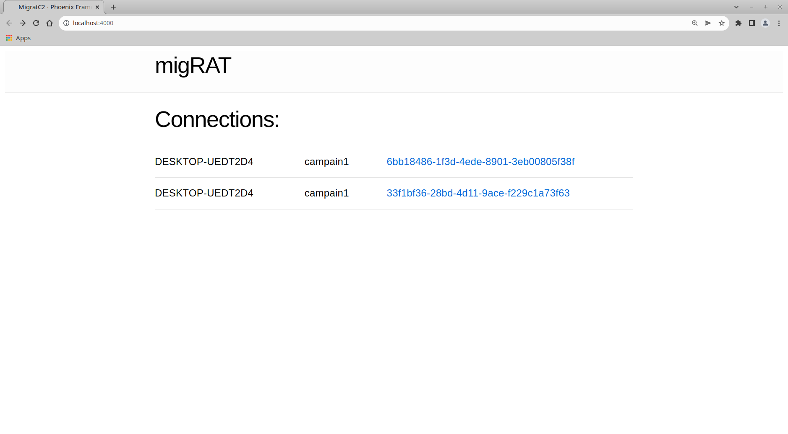
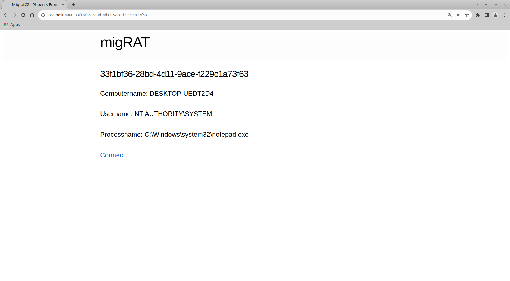
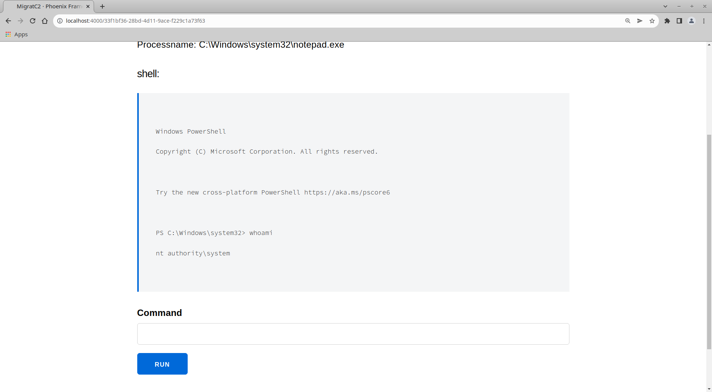
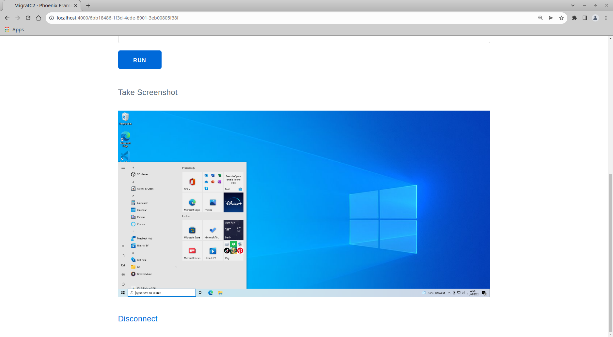

# migRAT

A (hopefully) stealthy Windows Remote Access Toolkit.

migRAT is an implant that can either be directly executet on the target or injectet as Shellcode. It periodicly pings back to its c&c server and only creates a persistent TCP connection on demand.

The c&c server provides a web Interface for easy management of connected Clients.

### Planned Features

- [x] Web Interface

- [x] Powershell Remote Access

- [ ] Dynamic modules

- [ ] Shellcode Injection

- [ ] Process Migration

- [x] Screenshots

- [ ] Keylogging

- [ ] UAC bypass

- [ ] encryptet communication (currently only xor)


### Building

Implant:

```
GOOS=windows go build .
```

c&c server:

```
mix phx.gen.release --docker
sudo docker build .
```


### Images








